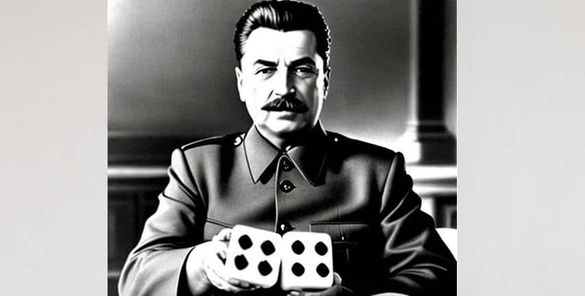

# Stalin-Bogo-Sort 

This is a combination of Stalin sort and Bogo sort.  
It shuffles the array k times and performs Staling sort on each, keeping and finally printing the best result (that with the biggest length).  
The result is gonna be Θ(k*n) and although the algorithm is not complete at sorting it can give a small sorted subset. 
#Examples 
#Warning the results are all based on luck! 
Output for n=100 k=10: 
Result Array: [31, 61, 64, 90, 95, 96, 99] Max Length: 7  
 
Output for n=100 k=1 (just stalin sort): 
Result Array: [91, 92, 97, 99] Max Length: 4 

